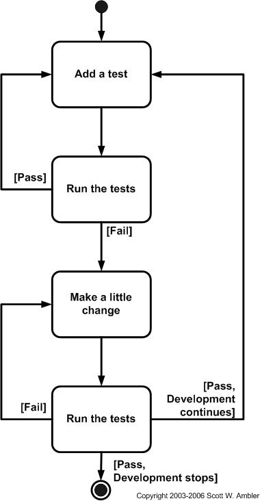

# Test Driven Development (TDD)

## Type Of Testing
* Unit testing
* TDD


## Modules For Testing In Python
* PyTest
* UnitTest

## Why TDD?
* TDD helps up reduce the risk of failure before sending a product to production


## Steps
* Create a file to write our tests
* Run tests and they will all fail
* Create a file to write our code
* Refactor and add code to pass the tests

## Naming Conventions
* File name:
	* .e.g. ```simple_calc```
* Test file name:
	* .e.g. ```test_simple_calc```


## Using The Testing Framework
* One needs to import the libraries and the class that one is testing .e.g.
```python
# import the class from simple_calc
from simple_calc import SimpleCalc

# import requiring testing frameworks
import unittest
import pytest
```
*  The class is declared, with ```unittest.TestCase``` inherited from
```python
# create a class to write tests input

# unittest.TestCase works with the unittest framework as a parent class
class CalcTest(unittest.TestCase):
```
* The testing function has the code inside, such as ```self.assertEqual``` which (as the name says) checks whether the two values come to a specified total. If so, evaluates to true.
```python
    # IMPORTANT - we must use TEST word in our functions, so python interpretor
    # knows what we are testing

    # Test the add function
    def test_add(self):
        # self.assertEqual(self.calc.add(num1, num2), total)
        # checks the numbers in the original function, and it should come to 6
        self.assertEqual(self.calc.add(2, 4), 6)  # True if pass
```
* Install pytest
```python
pip install pytest
```
* UnitTest is already installed

* Running pytest:
```python
python -m pytest
```
* If in virtual environment one can just run ```pytest```

* Running unittest (though pytest output appears to easier to read) uses the same command

## How Does ```pytest``` Work?

* It looks for the files with ```test_*.py``` and ```test*.py```
* ```-v``` is the verbose flag, shows more detail in the output

* We can use different condition with assertEqual as per business need
